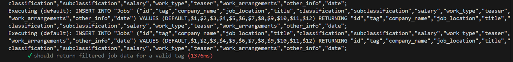

# Feeding-Data-JobStreet

This project scrapes job listings from JobStreet based on specific keywords (like JavaScript, ReactJS, Node.js, and Express), stores the data in a local database, and provides an API for managing the job data.

## Features

- Job scraping from JobStreet using Axios and Cheerio
- Store scraped data into PostgreSQL database
- CRUD operations for managing jobs
- Swagger documentation for API

## Requirements

- Node.v18.19.0
- PostgreSQL database
- NPM package manager

## Getting Started

**1. Clone the repository**

**2. Install dependencies**

```
npm install
```

**3. Setup PostgreSQL Database**

- Install PostgreSQL on your machine if you haven't already. Create a new database:

sql

```
CREATE DATABASE Db_Jobs;
```

- Create a jobs table with the following structure:

sql

```
CREATE TABLE IF NOT EXISTS public."Jobs"
(
id integer NOT NULL DEFAULT nextval('"Jobs_id_seq"'::regclass),
tag character varying(255) COLLATE pg_catalog."default" NOT NULL,
company_name character varying(255) COLLATE pg_catalog."default" NOT NULL,
job_location character varying(255) COLLATE pg_catalog."default" NOT NULL,
title character varying(255) COLLATE pg_catalog."default" NOT NULL,
classification character varying(255) COLLATE pg_catalog."default",
subclassification character varying(255) COLLATE pg_catalog."default",
salary character varying(255) COLLATE pg_catalog."default",
work_type character varying(255) COLLATE pg_catalog."default",
teaser character varying(255) COLLATE pg_catalog."default",
work_arrangements text COLLATE pg_catalog."default",
other_info text COLLATE pg_catalog."default",
date timestamp without time zone,
CONSTRAINT "Jobs_pkey" PRIMARY KEY (id)
)
```

**4. Setup Environment Variables**
File database.js

```
const sequelize = new Sequelize("Db_Jobs", "your_username", "your_password", {
host: "localhost",
dialect: "your_username",
});
```

Replace your_username, your_password, and other details accordingly.

**5. Run the Application**

To start the application, run:

```
node run server.js
```

This will start the server on http://localhost:3000.

**6. Scraping Jobs**
You can scrape jobs using the following API endpoint:

GET /scrape-filter-data?keywords=Java Spring

This will trigger a scraping process based on the keywords provided.

**7. Swagger API Documentation**

To access the Swagger UI for the API documentation visit http://localhost:3000/api-docs to view the Swagger UI.


**8. API Endpoints**

- **GET** /export-excel: Export job data to Excel
  
  
- **GET** /search : Search for jobs based on keywords
  
- **GET** /{id} : Get job based on id
  
- **DELETE** /{id} : Delete job based on id
  
- **PUT** /{id} : Job updates based on id
  
  
- **POST** / : Create a new job
  
  
- **GET** /scrape-filter-data/{tag} : Generate data using scraping based on keywords
  

**9. Running Tests**
To run tests, use the following command:

```
npm run test
```



